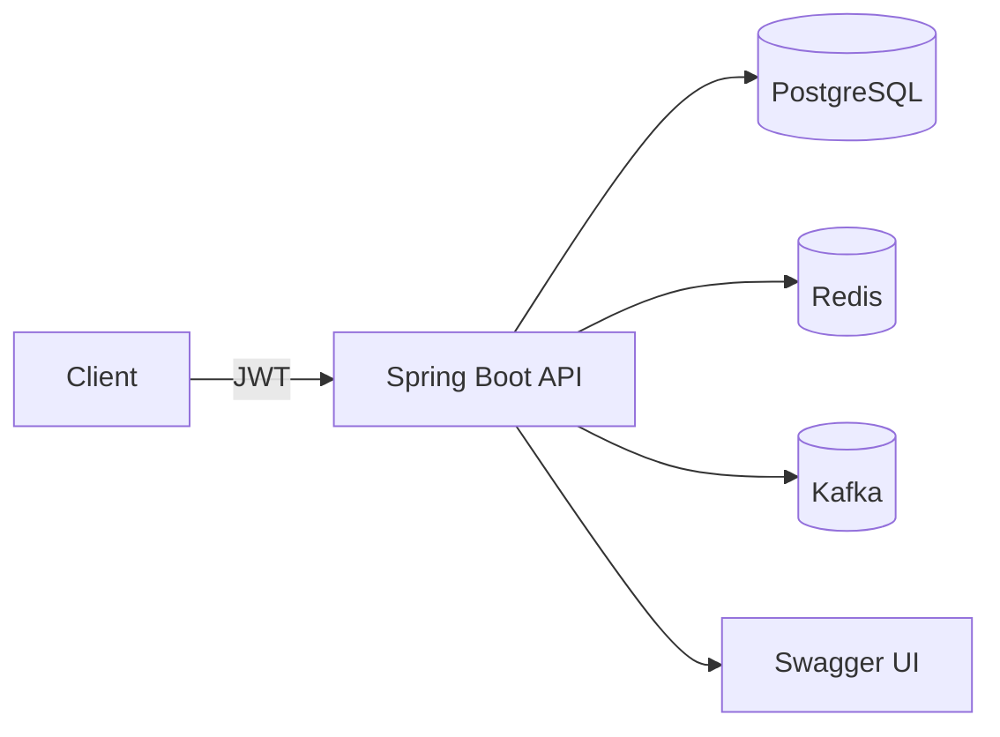

# FleetOps API 🚀
[](https://openjdk.org/projects/jdk/17/)  
[](https://spring.io/projects/spring-boot)  
[](https://github.com/dev-ricks/FleetOps-Api/actions/workflows/ci.yml)  
[](LICENSE)
[](https://www.linkedin.com/in/richard-smit-1a811b87/)

**Richard Smit: Senior Backend Engineer (Java 17, Spring Boot) • Secure APIs • OAuth2/JWT • Scalable Systems • Cloud-Native Solutions • Postgres • CI/CD • System Design**

**FleetOps API** is a **production-grade fleet management system** built with **Spring Boot 3, Java 17, OAuth2/JWT, PostgreSQL, Liquibase, Kafka, and Redis**.  
It demonstrates my ability to design, secure, test, and deploy modern APIs that scale in real-world enterprise environments.

👉 Featured in my [GitHub Profile](https://github.com/dev-ricks) as a showcase project.

---

## 📊 Why FleetOps?
Fleet operations power logistics, delivery, and transportation companies. This project demonstrates how to architect an API for:
- 🚛 Vehicle and driver management
- ✅ Inspections and compliance workflows
- 🔒 Secure data and access with OAuth2/JWT
- 📊 Observability via Spring Boot Actuator
- ⚡ Scalable integrations with Kafka + Redis

---

## 🖼️ Architecture Overview
*(High-level view — see [`docs/ARCHITECTURE.md`](docs/ARCHITECTURE.md) for details)*



✨ Highlights

- Enterprise-Ready Security → OAuth2 Resource Server with JWT validation.
- Data Integrity → Liquibase-managed schema migrations.
- Scalable Messaging → Kafka for event-driven workflows.
- Operational Visibility → Actuator endpoints for health, readiness, and metrics.
- Cloud-Ready → Dockerized with Compose for local infra; deployable to AWS ECS/EKS.
- Testing Excellence → Unit, slice, integration, and security tests with JUnit 5, Mockito, and H2.

---

## 🔐 Security

- See the [Security Documentation Index](docs/INDEX.md) for a full overview of security requirements, controls, and plans.
- Read the [Security Policy](docs/security/SECURITY_POLICY.md) for principles and responsibilities.
- Review the [Security Architecture Diagram](docs/security/diagrams/security-architecture.md) and [visual PNG](docs/security/assets/security-architecture.png).
- All security documentation is in the [docs/security/](docs/security/) folder, with diagrams in [docs/security/diagrams/](docs/security/diagrams/) and images in [docs/security/assets/](docs/security/assets/).

---

## Service Scope

- This repository contains a single Spring Boot service (not a multiservice deployment).
- It follows microservice-friendly practices: stateless API, externalized configuration, containerized runtime, CI/CD, OpenAPI, and Actuator.
- To evolve into a microservices architecture, split bounded contexts (Vehicles/Drivers/Inspections) into independently deployable services, adopt database-per-service and service discovery/API gateway, use async messaging where appropriate (e.g., Kafka), and add distributed observability.

---

## 🛠️ Tech Stack

- **Languages:** Java 17
- **Frameworks:** Spring Boot 3 (Web, Data JPA, Validation, Security, OAuth2)
- **Databases:** PostgreSQL (runtime), H2 (tests)
- **Infra:** Docker, Docker Compose, Liquibase, Redis, Kafka
- **Docs:** springdoc-openapi, Swagger UI
- **Testing:** JUnit 5, Mockito, Spring Boot Test, Testcontainers

---

## ✅ Features

- RESTful API built with Spring Boot 3
- Data persistence with Spring Data JPA (PostgreSQL runtime, H2 for tests)
- Schema migrations with Liquibase
- OAuth2/JWT Resource Server security
- API documentation via springdoc-openapi (Swagger UI)
- Dockerized runtime and Docker Compose for local infrastructure (PostgreSQL, Redis, Kafka, Zookeeper)
- Unit, slice, and integration tests

---

## 🚀 Getting Started

### Prerequisites
- JDK 17+
- Maven 3.9+
- Docker & Docker Compose (optional, for local infra)

### Quick Start (Windows PowerShell)
```powershell
# build and run locally
mvn clean verify
mvn spring-boot:run

# or with Docker Compose (full stack)
docker compose up --build
```

### Configuration
Configure environment variables (or `application.yml`) for PostgreSQL and JWT validation:

- `SPRING_DATASOURCE_URL` = `jdbc:postgresql://localhost:5432/fleetops`
- `SPRING_DATASOURCE_USERNAME` = `postgres`
- `SPRING_DATASOURCE_PASSWORD` = `postgres`
- `SPRING_JPA_HIBERNATE_DDL_AUTO` = `none` (Liquibase manages schema)
- `SPRING_LIQUIBASE_ENABLED` = `true`
- `spring.security.oauth2.resourceserver.jwt.issuer-uri` or `jwk-set-uri`

### 📍 Endpoints
- API → http://localhost:8080
- Swagger UI → http://localhost:8080/swagger-ui.html
- PostgreSQL → :5432 | Redis → :6379 | Kafka → :9092

### 📚 Documentation
- API Docs (Swagger UI) → http://localhost:8080/swagger-ui.html
- OpenAPI Contract → docs/openapi.yml
- Architecture Notes → docs/ARCHITECTURE.md
- Migration Guide → docs/MIGRATIONS.md
- Security Practices → SECURITY.md

### Operational Endpoints (Actuator)
- Health: http://localhost:8080/actuator/health
- Liveness: http://localhost:8080/actuator/health/liveness
- Readiness: http://localhost:8080/actuator/health/readiness
- Info: http://localhost:8080/actuator/info

Notes:
- Only basic health/info are exposed by default; detailed health is shown when authorized.
- See `src/main/resources/application.yml` under `management.*` for exposure configuration.

### Code-level Javadoc
Generate and open Javadoc locally (Windows PowerShell):
```powershell
mvn -q -DskipTests javadoc:javadoc
Start-Process "D:\work\source\java\FleetOps-API\target\site\apidocs\index.html"
```

### Alternative Run Methods (Windows PowerShell)

Run the built JAR locally:
```powershell
mvn -DskipTests package
java -jar target/fleetops-api.jar
```

Run with Docker (with environment variables):
```powershell
docker build -t fleetops-api:local .
docker run -p 8080:8080 `
  -e SPRING_DATASOURCE_URL=jdbc:postgresql://host.docker.internal:5432/fleetops `
  -e SPRING_DATASOURCE_USERNAME=postgres `
  -e SPRING_DATASOURCE_PASSWORD=postgres `
  fleetops-api:local
```

### Project Structure
```text
.
├─ src/
│  ├─ main/
│  │  ├─ java/                  # Controllers, services, repositories, entities
│  │  ├─ resources/             # application.yml, Liquibase changelogs, etc.
│  │  └─ proto/                 # (if applicable)
│  └─ test/…                    # Unit and integration tests (H2)
├─ docs/
│  ├─ openapi.yml               # API contract (source of truth for endpoints)
│  ├─ ARCHITECTURE.md
│  ├─ MIGRATIONS.md
│  └─ API.md
├─ Dockerfile
├─ docker-compose.yml
├─ pom.xml
└─ README.md
```

---

## 🧪 Testing
```bash
mvn test
```

- ✅ Unit tests with JUnit 5 + Mockito
- ✅ Slice tests for controllers and services
- ✅ Integration tests with H2
- ✅ Security tests with spring-security-test

---

## 📊 How This Demonstrates My Skills

FleetOpsApi reflects my approach to enterprise-grade engineering:

- **Architecture & Design** → Clean layering, event-driven workflows, resilient infra.
- **Security & Compliance** → OAuth2/JWT, structured error handling, role-based access.
- **Scalability** → Containers, Kafka, Redis, AWS-ready deployments.
- **Quality** → Comprehensive testing, CI/CD pipelines, observability baked in.

---

## 📄 License
Licensed under the MIT License.

---

## 🛠️ Troubleshooting

- __Database connectivity__: verify `SPRING_DATASOURCE_*` variables and DB availability.
- __Liquibase errors__: ensure changesets are included and formatted correctly; see `docs/MIGRATIONS.md`.
- __JWT validation failures__: check `issuer-uri` or `jwk-set-uri`, token audience/scope, and clock skew.

---

## 🤝 Contributing

See `CONTRIBUTING.md` for branch strategy, commit messages, code style, testing, and PR process.
